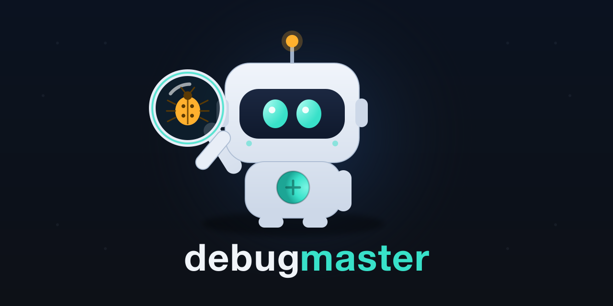

<div align="center">



# debugmaster

**The polyglot hidden-bug hunter.** One command finds the small, high-impact bugs
compilers and single linters miss — across Python, JS/TS, Go, Rust, and 60+ stacks —
fuses every scanner you have into **one ranked queue**, and **learns from your
feedback so each run is sharper than the last**.

[](LICENSE)
[](#requirements)
[](tests/)
[](CHANGELOG.md)
[-success.svg)](#how-it-degrades)

</div>

---

## Why debugmaster

Every scanner inside debugmaster is best-in-class and built by someone else —
`ruff`, `biome`, `oxlint`, `golangci-lint`, `clippy`, `semgrep`, `gitleaks`.
debugmaster's value is the **layer on top of them**:

- **One ranked queue, not ten reports.** It normalizes 12+ scanners into a single
  `Finding` schema, dedupes by `(file, line)`, and returns one prioritized list.
- **Ranked by *real* impact** — `severity × learned-precision × blast-radius × dirty`.
  Not "error at line 12", but "this is in code you just touched, a lot depends on it,
  and this rule is usually right on *your* repo."
- **Finds bugs linters can't see.** A business-logic engine flags IDOR (missing
  ownership checks), oversell/overdraw races, float-money math, mass-assignment
  (over-posting), and brute-forceable auth — semantic bugs, not style nits.
- **It compounds.** `fix-verify` and `learn-feedback` teach the per-rule precision
  ranker, so the noise drops and the signal rises the more you use it.
- **Honest depth.** Runs on **zero dependencies** (pure-stdlib core) up to full depth,
  and `doctor` tells you exactly which layers are live before you trust a hunt.
- **Agent-native & local.** Every finding ships with evidence, a fix hint, and a
  verify command. Local, deterministic, bounded by a time budget — no cloud upload,
  no per-seat SaaS, never hangs.

> debugmaster does **not** replace your runtime debugger (gdb/lldb/delve) or deep
> taint analysis (CodeQL). It orchestrates and out-prioritizes the static layer.

---

## Quick start

```bash
git clone https://git.marketdeck.io/Supersynergy/debugmaster.git
cd debugmaster
./install.sh --link              # symlink `debugmaster` into ~/.local/bin
debugmaster engines-install --yes # optional: onboard the best-in-class engine stack
debugmaster hunt .                # find the smallest hidden bugs, ranked by impact
```

No engines installed? It still works — the pure-stdlib static + business-logic
engines run everywhere. `debugmaster doctor` shows your current depth.

---

## Core commands

```bash
debugmaster hunt .                        # ranked hidden bugs (the flagship)
debugmaster hunt . --dirty                # only what you're touching right now
debugmaster hunt . --profile deep --json  # + semgrep/osv/clippy/golangci, machine output
debugmaster audit .                       # SUPER-AUDIT: graded health + SHIP/FIX-FIRST/BLOCK
debugmaster audit . --save-baseline       # lock the bar; later runs show regressions vs fixed
debugmaster profile -- python3 app.py     # RUNTIME: memory/fd/gpu leaks, cpu bottleneck, orphans
debugmaster mcp                           # run as an MCP server (agent tools over stdio)
debugmaster watch .                       # re-scan changed files on every save
debugmaster review . --base main --comment  # PR verdict, posted as a PR/MR comment (gh/glab)
debugmaster hunt . --triage               # + local-LLM second opinion on the top suspects
debugmaster regress app.py py-shell-true  # generate a pytest that locks the fix forever
debugmaster checks --domain payments      # business-debug catalog: 200 revenue/billing surfaces
debugmaster explain - < trace.txt         # localize a stacktrace → suspect files
debugmaster bisect --good v1 --bad HEAD --test "pytest -x"   # → first bad commit
debugmaster scan-bugs . --class biz       # business-logic bugs (IDOR, money, mass-assign, …)
debugmaster fix-verify app.py py-bare-except   # run the finding's verify cmd, auto-learn on pass
debugmaster doctor                        # which detection layers are live here
debugmaster all . --timeout 60            # full repo report (md + json + AI brief)
```

### Runtime diagnostician (`profile`)

`hunt` finds the bug in the source; **`profile` finds it while the code runs.** Wrap a
command or attach to a PID — it samples the whole process tree and *diagnoses* (vs a
passive sampler):

- **memory leak** — least-squares RSS trend (MB/min + R²), flagged only when sustained
  and still climbing, not a one-off spike.
- **fd / thread leak** — descriptor / thread count trending up.
- **cpu bottleneck** — one process pinned ~1 core while the rest idle (parallelize!)
  vs healthy multi-core saturation.
- **gpu pressure / VRAM leak** — NVIDIA (`nvidia-smi`) or Apple Silicon (`ioreg`).
- **orphan / zombie leak** — children still alive *after* the command exits.

```bash
debugmaster profile -- python3 train.py     # diagnose a run
debugmaster profile --pid 4123 --duration 30  # attach to a live process
```

### Business / revenue debugging (`checks`)

`debugmaster checks` is a catalog of **200 revenue/billing failure surfaces** —
payments, subscription, invoice, ledger, refunds, checkout, tax, pricing, webhook,
fulfillment, customer. The 13 highest-impact ones are auto-detected (webhook-no-
signature, client-controlled-price, idempotency, money-float…); the rest hand you a
ready `ghgrep` search + a verify hint.

```bash
debugmaster checks --stats             # coverage by domain
debugmaster checks --domain payments   # the payment checklist
debugmaster checks --detected          # what debugmaster finds for free
```

See **[PLAYBOOK.md](PLAYBOOK.md)** for how to combine debugmaster + ghmax + ghgrep.

### Use it from your agent (MCP)

debugmaster runs as an MCP server, so Claude Code / Codex / Cursor can call
`hunt`, `audit`, `review`, `explain`, and `profile` directly:

```json
{ "mcpServers": { "debugmaster": { "command": "debugmaster", "args": ["mcp"] } } }
```

### Super-audit & release gate

`hunt` finds suspects; `audit` **grades the repo and decides whether it ships** — a
0–100 score + letter grade per dimension (security, business-logic, correctness,
reliability, maintainability, test-coverage), an overall grade, and a verdict of
**SHIP / FIX-FIRST / BLOCK** (non-zero exit unless `SHIP`, so it gates CI).
`--save-baseline` records a baseline; later audits show the score delta and
**regressions introduced vs findings fixed**.

### Fast, but a good neighbour

The static scan and scanner fusion run in parallel, but capped at **~75% of cores**
by default so a hunt never pins your machine. Tune it:

```bash
DEBUGMASTER_CPU_FRACTION=0.5 debugmaster hunt .   # use half the cores
DEBUGMASTER_WORKERS=4 debugmaster hunt .           # or pin an exact worker count
```

### Silence the noise (no false-positive fatigue)

Accepted findings stay quiet via a `.debugmaster-ignore` file (`rule`,
`path-glob:rule`, or `path-glob`) or an inline `# debugmaster: ignore[rule-id]`
marker — and the **suppressed count is always reported**, so a clean grade can
never be faked by over-muting.

---

## How `hunt` works

`hunt` runs six engines in one bounded pass and returns the smallest, best-hidden
bugs — each with evidence, a fix hint, and a verify command:

| Engine | Finds |
|---|---|
| **static** | swallowed errors, mutable defaults, copy-paste asymmetry, blocking-in-async, injection sinks, hardcoded secrets |
| **business-logic** | IDOR, oversell races, float-money, mass-assignment, auth-no-ratelimit, SSRF, open-redirect, idempotency, webhook-no-signature, client-controlled-price |
| **fusion** | normalized findings from every installed scanner (see below) |
| **history** | bug-prone files via git defect mining + co-change coupling |
| **risk** | IsolationForest risk score (sklearn) or heuristic fallback |
| **reach** | blast-radius via call-graph fan-in (codegraph/grepgod) or import heuristic |

Findings are ranked by **`severity × learned-precision × blast-radius × dirty`** and
deduped into a single queue.

### Fused scanners (June-2026 best-practice set)

| Language | Scanners debugmaster fuses |
|---|---|
| Python | `ruff`, `bandit`, `vulture`, `mypy` |
| JS / TS | **`biome`**, **`oxlint`** |
| Go | **`golangci-lint`** (bundles staticcheck/govet/errcheck/gosec) |
| Rust | `cargo clippy` |
| Shell / CI | `shellcheck`, `actionlint` |
| Polyglot | `semgrep`, `gitleaks` (secrets), `osv-scanner` + `trivy` (deps), `ast-grep` |

Each is availability-gated and degrades to a logged skip when absent — **no silent
truncation**.

---

## How it degrades

```text
depth = 10/10 layers live
```

| If you have… | You get… |
|---|---|
| nothing but Python 3.10+ | static + business-logic engines (pure stdlib) |
| the fused scanners | normalized polyglot findings in the queue |
| `numpy` + `scikit-learn` | IsolationForest risk model (else heuristic) |
| `codegraph` / `grepgod` | resolved call-graph blast-radius (else import heuristic) |
| `git` | dirty-impact weighting, history mining, `review`, `bisect` |

Run `debugmaster doctor` to see your exact depth and what to install to go deeper.

## Engine onboarding

```bash
debugmaster engines-install --list         # preview the plan, install nothing
debugmaster engines-install --yes          # install all groups
debugmaster engines-install --only js,go   # just JS/TS + Go linters
```

Idempotent (skips what's present), reversible (only adds tools), honest (prints what
it ran). Groups: `fusion js go rust python-debug native llm ml`. Uses whichever of
`brew / uv / bun / cargo / go` you already have.

---

## Reports

```bash
debugmaster all <repo> --timeout 120
```

Writes a Markdown report, a JSON report, and an AI-ready brief with: repo identity +
git status, structure, the detected stack matrix with official references, the top
diagnostic flows, dirty-impact ranking, an opt-in security/dependency scan, a
`PASS` / `WARN` / `FAIL` verdict, and the next 5 fixes for an agent to pick up.

## Architecture

```text
bin/debugmaster        # the CLI (stdlib launcher, polyglot scanner)
install-engines.sh     # the engine onboarding installer
lib/                   # analysis engines
  bughunt.py           #   static hidden-bug rules (regex + Python AST)
  bizlogic.py          #   business-logic / semantic bug engine
  fusion.py            #   run + normalize + dedupe every installed scanner
  gitrisk.py           #   git defect mining + co-change coupling
  riskmodel.py         #   IsolationForest risk scoring (+ heuristic fallback)
  reach.py             #   call-graph blast-radius
  learn.py             #   per-rule precision learning loop
  hunt.py              #   the flagship: fuse → rank → explain
  doctor.py            #   capability self-audit
debugger-engines.json  # 100+ debugger/profiler/observability tool catalog
HUNTING.md             # deep-dive on hunt and the engines
```

## Requirements

- **Python 3.10+** — that's the only hard requirement.
- Everything else is optional and detected at runtime via `doctor`.

## Contributing & security

- [`CONTRIBUTING.md`](CONTRIBUTING.md) · [`SECURITY.md`](SECURITY.md) · [`CODE_OF_CONDUCT.md`](CODE_OF_CONDUCT.md)
- Run the suite: `python3 -m pytest -q tests/`

## License

[MIT](LICENSE) © 2026 Supersynergy.
